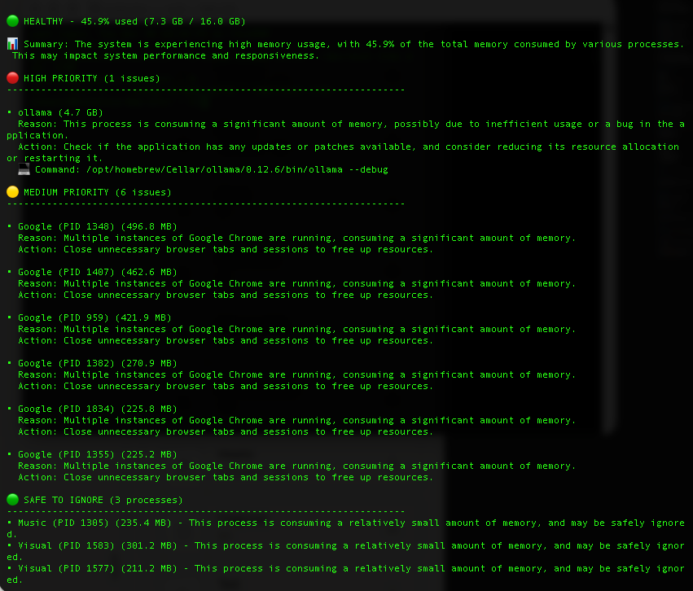

# WhoAteMyRAM (wamr)

[](LICENSE)
[](https://www.python.org/downloads/)
[](https://github.com/yourusername/whoatemyram)

**LLM-powered memory analysis for developers**

Stop guessing what's eating your RAM. Get intelligent, actionable insights in plain English.



---

## 🎯 The Problem

You're coding. System slows down. You check `htop` and see 87% memory usage.

**Now what?**

- Which processes are safe to kill?
- What's a memory leak vs. normal behavior?
- Should you close those 47 Chrome tabs?

Traditional tools (`htop`, `free`, `top`) show you **data**. WhoAteMyRAM gives you **understanding**.

---

## ✨ The Solution

```bash
$ wamr

💾 WhoAteMyRAM - Memory Analysis
══════════════════════════════════════════════════════════════

🟡 WARNING - 73.2% used (11.7 GB / 16.0 GB)

📊 Summary: High memory usage detected with multiple browser 
processes and development tools running.

🔴 HIGH PRIORITY (2 issues)

• chrome (PID 12091) - 3.2 GB
  Reason: 47 tabs open, 28 idle for >2 hours
  Action: Close idle tabs to reclaim ~1.8 GB
  💻 Command: chrome://discards

• docker-compose (PID 8432) - 2.1 GB
  Reason: old-project containers haven't been accessed in 14 days
  Action: Stop unused containers
  💻 Command: cd ~/old-project && docker-compose down

🟢 SAFE TO IGNORE (3 processes)

• node (1.4 GB) - Active webpack dev server
• ollama (1.1 GB) - Running this analysis
• slack (856 MB) - Active messaging client

💰 Total Reclaimable: ~3.9 GB
```

---

## 🚀 Quick Start

### Prerequisites

- Python 3.8+
- [Ollama](https://ollama.ai)
- Linux or macOS

### Install

```bash
# 1. Clone the repo
git clone https://github.com/yourusername/whoatemyram.git
cd whoatemyram

# 2. Install dependencies
pip install -r requirements.txt

# 3. Install Ollama and pull a model
curl -fsSL https://ollama.ai/install.sh | sh
ollama serve &
ollama pull llama3.2:3b

# 4. Run it!
python3 wamr.py
```

Or use the installer:

```bash
chmod +x install.sh
./install.sh
```

---

## 🎮 Usage

```bash
# Full LLM analysis
wamr

# See demo output (no Ollama needed)
wamr --demo

# Quick check (no LLM)
wamr --no-llm

# Use different model
wamr --model llama3.1:8b

# Output as JSON
wamr --json

# See all options
wamr --help
```

---

## 🌟 Features

- 🤖 **LLM-powered analysis** - Uses local Ollama for intelligent insights
- 🎯 **Actionable suggestions** - Get specific commands to fix issues
- 🔒 **Privacy-first** - Everything runs locally, no cloud APIs
- ⚡ **Fast** - Analysis completes in 5-15 seconds
- 🎨 **Beautiful output** - Color-coded, emoji-enhanced terminal UI
- 🔧 **Zero config** - Works out of the box
- 🍎 **Cross-platform** - Linux and macOS support
- 📊 **Multiple modes** - Demo, quick check, or full analysis

---

## 📖 Documentation

- **[QUICKSTART.md](QUICKSTART.md)** - 5-minute setup guide
- **[EXAMPLES.md](EXAMPLES.md)** - Usage scenarios and examples
- **[MACOS.md](MACOS.md)** - macOS-specific setup 🍎
- **[CONTRIBUTING.md](CONTRIBUTING.md)** - How to contribute
- **[HOWTO.md](HOWTO.md)** - Detailed local setup

---

## 🔧 How It Works

1. **Scan** - Reads system memory and process data
2. **Analyze** - Sends data to local LLM (via Ollama)
3. **Understand** - LLM identifies issues, patterns, and opportunities
4. **Present** - Shows color-coded, actionable results

```
System Data → Local LLM → Intelligent Analysis → You Fix Issues
```

**No cloud. No tracking. Just smart, local analysis.**

---

## 💡 Why Local LLM?

| Cloud Tools | WhoAteMyRAM |
|-------------|-------------|
| 💰 Monthly fees | ✅ Free forever |
| ☁️ Send data to cloud | ✅ 100% local |
| 🌐 Requires internet | ✅ Works offline |
| 📊 Generic advice | ✅ Context-aware |
| 🔒 Privacy concerns | ✅ Privacy-first |

---

## 🎯 Use Cases

### For Developers
- Debug memory issues during development
- Understand what dev tools are using
- Identify memory leaks in your code

### For DevOps
- Quick diagnosis on production boxes
- Understand memory pressure
- Get actionable remediation steps

### For Everyone
- Know when to close browser tabs
- Understand what's really using memory
- Make informed decisions about killing processes

---

## 🆚 Comparison

| Tool | Shows | Analysis | Output |
|------|-------|----------|--------|
| `htop` | Raw process list | None | Numbers |
| `free` | Memory stats | None | Numbers |
| `top` | System stats | None | Numbers |
| Activity Monitor | Process list | None | GUI |
| **wamr** | Memory diagnosis | LLM-powered | Natural language + commands |

---

## 🏗️ Platform Support

### Linux ✅
- Ubuntu 20.04+
- Debian 10+
- Arch Linux
- Fedora 35+
- Any distro with `/proc/meminfo`

### macOS ✅
- macOS 13+ (Ventura)
- macOS 14+ (Sonoma)
- macOS 15+ (Sequoia)
- Both Intel and Apple Silicon

### Windows ⏳
- Planned for future release

---

## 📊 Performance

- **Scan time:** <1 second
- **LLM analysis:** 3-10 seconds (model dependent)
- **Total time:** ~5-15 seconds end-to-end

**Tested models:**
- `llama3.2:1b` - Fastest (~3s)
- `llama3.2:3b` - Recommended (~5s)
- `llama3.1:8b` - Best quality (~10s)

---

## 🤝 Contributing

We love contributions! See [CONTRIBUTING.md](CONTRIBUTING.md) for guidelines.

**Quick ways to help:**
- 🐛 Report bugs
- 💡 Suggest features
- 📝 Improve documentation
- 🔧 Submit pull requests
- ⭐ Star the repo!

---

## 🗺️ Roadmap

- [x] Linux support
- [x] macOS support
- [x] Demo mode
- [x] JSON output
- [ ] Memory leak tracking
- [ ] Historical comparison
- [ ] Interactive kill mode
- [ ] Windows support
- [ ] Homebrew formula
- [ ] More LLM backends

---

## 📄 License

MIT License - see [LICENSE](LICENSE) for details.

---

## 🙏 Acknowledgments

- Inspired by [witr](https://github.com/pranshuparmar/witr)
- Built with [Ollama](https://ollama.ai) and assistance from Claude AI
- Powered by local LLMs

---

## 🎓 Learn More

**Blog posts:**
- [Coming soon] How WhoAteMyRAM works

**Videos:**
- [Coming soon] Demo and tutorial

**Community:**
- GitHub Discussions
- Issues and PRs welcome

---

## ⭐ Show Your Support

If WhoAteMyRAM helps you understand your system better, give it a star! ⭐

It helps others discover the project.

---

## 📞 Contact

- **Issues:** [GitHub Issues](https://github.com/sukanto-m/whoatemyram/issues)
- **Discussions:** [GitHub Discussions](https://github.com/sukanto-m/whoatemyram/discussions)

---

<p align="center">
  <strong>Built with ❤️ for the local LLM community</strong>
  <br>
  <sub>Making system utilities intelligent, one tool at a time</sub>
</p>

<p align="center">
  <a href="#quick-start">Get Started</a> •
  <a href="QUICKSTART.md">Quickstart</a> •
  <a href="EXAMPLES.md">Examples</a> •
  <a href="CONTRIBUTING.md">Contribute</a>
</p>
